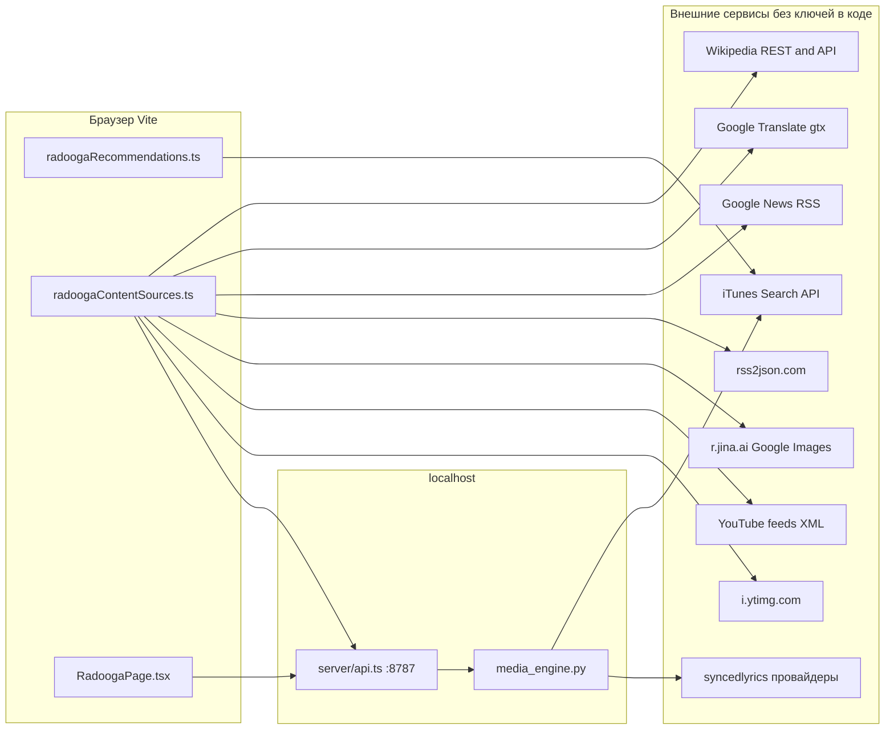

# Откуда что тянется (Radooga и скачивание)

Ниже — **все сетевые источники**, которые участвуют в обогащении ленты и в загрузке треков. **API-ключи в коде не передаются**, кроме опционального `GENIUS_ACCESS_TOKEN` для текста песен на бэкенде.

---

## 1. Лента кандидатов (поиск треков)

| Что | Откуда | Ключ |
|-----|--------|------|
| Подбор треков под запрос | `https://itunes.apple.com/search?entity=song&limit=35&term=...` в [`src/lib/radoogaRecommendations.ts`](../src/lib/radoogaRecommendations.ts) | Нет |

---

## 2. Обогащение Radooga (всё из браузера)

Файл: [`src/lib/radoogaContentSources.ts`](../src/lib/radoogaContentSources.ts).

| Слой | Цепочка запросов | Ключ |
|------|------------------|------|
| **Текст (snippet)** | `POST /api/lyrics/lookup` → см. §4 | См. §4 |
| **Факты** | RU/EN `*.wikipedia.org/w/api.php` (поиск) + `api/rest_v1/page/summary/...`; иногда локальные строки `MUSIC_WORLD_FACTS`; для EN после извлечения — перевод | Нет |
| **Перевод фактов** | `https://translate.googleapis.com/translate_a/single?client=gtx&...` (неофициальный «gtx») | Нет в коде (ToS/стабильность — на совести сервиса) |
| **Новости** | `GET /api/news/multi?artist=...` — **rss-parser** на бэке: Google News RSS (ru+en), The Guardian Music, Pitchfork, NME, плюс **DuckDuckGo** `news.js`; обложка рядом с карточкой — **Deezer** `search/artist` (без ключа). Клиент: [`resolveLiveNews`](../src/lib/radoogaContentSources.ts) | Нужен `npm run api` |
| **Фото** | **DuckDuckGo Images** через `r.jina.ai`; фолбэк — Google Images + jina; далее Wikipedia; фолбэк — `artworkUrl` / SVG | Нет |
| **Концерты** | Тот же паттерн: Google News RSS → rss2json; фолбэк — ссылка на `google.com/search` | Нет |
| **Видео** | `https://www.youtube.com/feeds/videos.xml?search_query=...` → rss2json; превью `https://i.ytimg.com/vi/{id}/hqdefault.jpg` | Нет |

---

## 3. Страница Radooga и превью обложки

Файл: [`src/pages/RadoogaPage.tsx`](../src/pages/RadoogaPage.tsx).

| Что | Откуда | Ключ |
|-----|--------|------|
| Скачивание превью в библиотеку | `POST /api/download` (прокси Vite →8787) | Нет |
| Обложка после ответа | `fetch(candidate.artworkUrl)` — обычно CDN iTunes из метаданных кандидата | Нет |
| Отладочные `fetch` на `http://127.0.0.1:7256/ingest/...` | Локальный коллектор (не продуктовые данные) | Нет |

---

## 4. Локальный API и Python

Файл: [`server/api.ts`](../server/api.ts) (прокси в [`vite.config.ts`](../vite.config.ts): `/api` → `http://localhost:8787`).

| Эндпоинт | Что делает | Внешнее |
|----------|------------|---------|
| `GET /api/search/youtube` | `yt-dlp` поиск | YouTube через yt-dlp, без API-ключа в коде |
| `POST /api/metadata/extract` | `yt-dlp --dump-single-json` | То же |
| `POST /api/download` | `python3` → `media_engine.process_media` | yt-dlp скачивание + см. ниже |
| `POST /api/lyrics/lookup` | `python3` → `_fetch_lyrics` | См. ниже |
| `GET /api/rss/proxy` | Загрузка RSS/Atom (allowlist: `news.google.com`, `www.youtube.com`), разбор в JSON для клиента | Google News / YouTube feeds |
| `GET /api/news/multi` | Параллельный разбор нескольких RSS + DDG news.js; Deezer для `artistImage` | Google, Guardian, Pitchfork, NME, DuckDuckGo, Deezer |

Файл: [`media_engine.py`](../media_engine.py).

| Функция | Внешнее | Ключ |
|---------|---------|------|
| `_fetch_lyrics` | Сначала **syncedlyrics** (внешние LRC/текстовые провайдеры, зависит от библиотеки) | Нет |
| `_fetch_lyrics` (fallback) | **lyricsgenius** только если задан `GENIUS_ACCESS_TOKEN` | **Да, опционально** |
| `_fetch_itunes_metadata` / обложка в тегах | `https://itunes.apple.com/search?...` | Нет |
| `_download_artwork_bytes` | Произвольный `artworkUrl` (часто iTunes/YouTube thumb) | Нет |
| `process_media` | **YoutubeDL** (`yt-dlp`) — загрузка аудио | Нет ключа в коде |

---

## 5. Что в проекте про «ключи», но не используется в Radooga

- В [`vite.config.ts`](../vite.config.ts) пробрасывается `process.env.GEMINI_API_KEY`, но по `src/` **нет обращений к GEMINI** — на обогащение Radooga не влияет.

---

## Итог «главное без ключей»

- **Вся клиентская обвязка Radooga** (Wiki, новости через RSS, jina, YouTube RSS, iTunes для рекомендаций) — **без ключей в репозитории**.
- **Единственный явный ключ** — `GENIUS_ACCESS_TOKEN` для второго шага текста песен в Python; без него остаётся **syncedlyrics** (и санитайзер на клиенте после `/api/lyrics/lookup`).
- **Риски без ключей**: лимиты/блокировки rss2json, jina, gtx, публичных RSS; стабильность yt-dlp/YouTube по IP/региону — это не ключи, но внешние ограничения.
